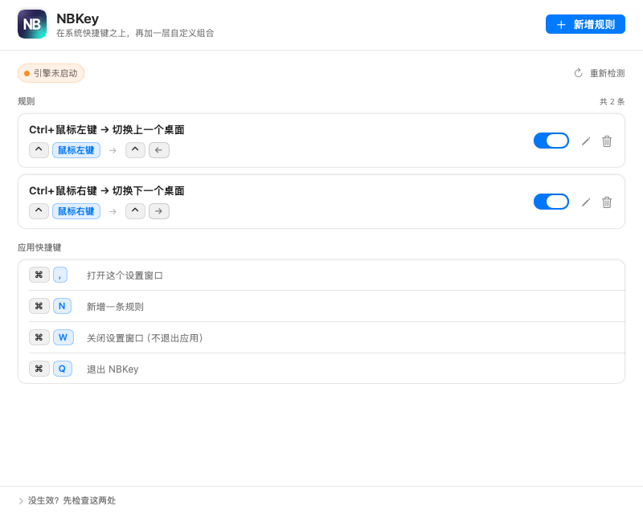
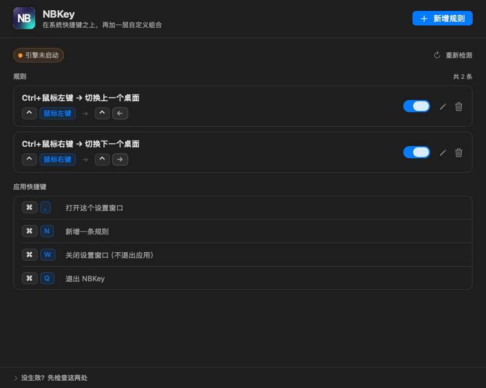
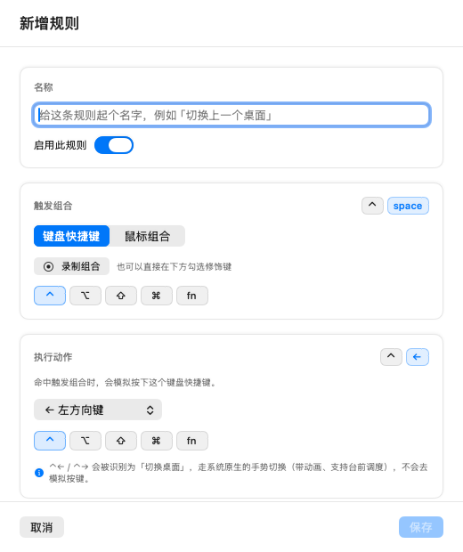
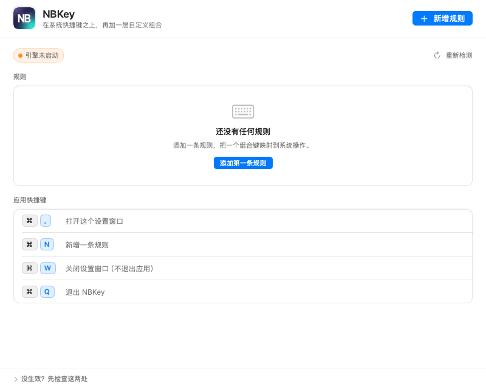

# NBKey

> 在系统快捷键之上，再加一层自定义组合。

macOS 的键盘快捷键只能绑「键盘组合」。但有些操作，用**鼠标 + 修饰键**触发才是最顺手的 ——
比如「按住 Control 点一下鼠标左键就切到上一个桌面」。

NBKey 是一个纯菜单栏（不出现在 Dock）的小工具，它**拦截**你指定的组合键/鼠标键，
然后代为执行一个系统快捷键。不替代系统设置，只是补上系统本身组合不出来的那些操作。

## 下载

到 [Releases](https://github.com/ixinglan/NBKey/releases/latest) 下载 `NBKey-x.y.z.dmg`，
打开后把 **NBKey.app** 拖进「应用程序」即可。

安装包为**通用二进制**（Apple Silicon + Intel），已用 Developer ID 签名并完成 Apple 公证，
双击即可打开。DMG 附带 `.sha256` 校验文件。

要求 **macOS 14.0 (Sonoma)** 或更高。

---

## 目录

- [一、功能](#一功能)
- [二、安装与首次使用](#二安装与首次使用)
- [三、界面导览](#三界面导览)
- [四、配置示例](#四配置示例)
- [五、快捷键](#五快捷键)
- [六、常见问题](#六常见问题)
- [七、技术实现](#七技术实现)
- [八、构建与自检](#八构建与自检)
- [九、发布流程](#九发布流程)

---

## 一、功能

| 能力 | 说明 |
|---|---|
| **自定义触发组合** | 支持键盘组合（任意键 + ⌃⌥⇧⌘fn）与鼠标组合（左/右/中/侧键 + 修饰键）；也可以直接「录制」 |
| **映射到系统快捷键** | 命中后模拟按下目标快捷键；目标键覆盖方向键、F1–F12、Esc、Tab、Return、Home/End、PageUp/Down 等 |
| **真正「拦截」原事件** | 命中时原始事件会被吃掉 —— 例如 ⌃+鼠标右键不会再弹出右键菜单，而是直接切换桌面 |
| **切换桌面走原生路径** | 当动作是 ⌃← / ⌃→ 时，NBKey 不模拟按键，而是驱动系统自己的桌面切换手势：**带动画、台前调度正常工作** |
| **多显示器正确** | 桌面切换只作用于**鼠标所在那块屏**，与系统行为一致 |
| **边界不循环** | 已经在最左/最右桌面时不会绕回另一端 |
| **规则开关 / 冲突提示** | 每条规则可单独停用；触发组合重复时会明确标出「冲突」 |
| **规则持久化** | 保存在 `~/Library/Application Support/NBKey/rules.json` |

---

## 二、安装与首次使用

1. 下载 DMG（见上），打开后把 `NBKey.app` 拖进「应用程序」并启动。
   - 正式版已签名并公证，双击即可打开。
   - **若提示「无法验证开发者」**（自行构建、或拿到未公证的包），执行一次
     `xattr -dr com.apple.quarantine /Applications/NBKey.app`，
     或按住 Control 点击图标 → 「打开」。
2. 首次启动会请求**辅助功能（Accessibility）权限** —— 这是 macOS 对「监听并拦截全局键鼠事件」的硬性要求，
   没有它任何组合都拦不住。
   - 路径：**系统设置 › 隐私与安全性 › 辅助功能** → 勾选 NBKey。
   - 授权后**切回 NBKey 窗口**，它会自动重试启动引擎，不需要手动重启应用。
3. 菜单栏出现 NBKey 图标即表示已就绪。状态栏会显示「引擎运行中」。

> 应用没有 Dock 图标。所有操作都从菜单栏图标进入：**设置…** / **检查权限并重试引擎** / **打开诊断日志** / **退出**。

> ⚠️ **权限是跟签名绑定的**。换了签名方式（例如从自行构建的开发签名换成正式版签名、
> 或换了证书重新签名）之后，辅助功能里会认成一个「新的」应用，需要重新勾选一次。

---

## 三、界面导览

打开设置（菜单栏图标 → 设置…，或窗口内按 ⌘,）：



自上而下五层：

1. **头部栏** —— 产品标识 + 副标题，右侧是全局主动作「新增规则」（⌘N）。
2. **状态区** —— 引擎与权限状态胶囊，右侧「重新检测」可强制重新检查权限并拉起引擎。
   未授权时会额外出现一条橙色横幅，内含「去开启权限 / 我已开启，重试」两个按钮。
3. **规则区** —— 每条规则一张卡片，左侧是「**触发 → 动作**」的键帽对照，右侧是开关与编辑/删除。
   - 卡片标题旁的灰色胶囊表示「已停用」，红色胶囊表示「触发组合重复」。
   - 规则为空时显示引导空态，不会留一块白板。
4. **应用快捷键区** —— 列出本应用自己的四个快捷键（⌘, / ⌘N / ⌘W / ⌘Q），
   省得「装完就忘了还能这么关窗口」。
5. **帮助区**（钉在窗口底部）—— 「没生效？先检查这两处」，点开就是两条最常踩的排查项。

界面全部使用系统语义色，深色模式自动跟随，无需单独设置：



新增/编辑规则时弹出编辑面板：



面板分三块：**名称与启用** / **触发组合** / **执行动作**。两个组合区块的右上角都有实时键帽预览，
勾选修饰键时立刻能看到最终组合长什么样。触发组合重复时，面板底部会出现红色警示。

空态：



---

## 四、配置示例

### 示例 1：⌃ + 鼠标左键 → 切换上一个桌面（默认已带）

| 项 | 值 |
|---|---|
| 名称 | `Ctrl+鼠标左键 → 切换上一个桌面` |
| 触发组合 | 类型选「鼠标组合」，修饰键勾 **⌃**，按键 **左键** |
| 执行动作 | 修饰键勾 **⌃**，目标键选 **← 左方向键** |

作用：按住 Control 点鼠标左键 = 上一个桌面。原本的右键菜单不会再弹出（事件被吃掉了）。

### 示例 2：⌃ + 鼠标右键 → 切换下一个桌面（默认已带）

同上，把「左键」换成「右键」，「←」换成「→」。

### 示例 3：鼠标中键 → 调度中心

| 项 | 值 |
|---|---|
| 触发组合 | 类型「鼠标组合」，**不勾任何修饰键**，按键 **中键** |
| 执行动作 | 修饰键勾 **⌃**，目标键选 **↑ 上方向键** |

作用：按一下鼠标中键等于按 ⌃↑，弹出调度中心 / 显示所有窗口。
（中键、侧键允许不配修饰键单独使用；左/右键必须至少配一个修饰键，
否则会把所有普通点击都劫持掉。）

### 示例 4：⌃ + 鼠标中键 → 「应用窗口」

| 项 | 值 |
|---|---|
| 触发组合 | 修饰键 **⌃**，按键 **中键** |
| 执行动作 | 修饰键 **⌃**，目标键 **↓ 下方向键** |

### 自己加一条的步骤

1. 点右上角「**新增规则**」（或按 ⌘N）。
2. 填**名称**（必填，保存按钮在名称为空时是禁用的）。
3. 在「触发组合」里选类型：
   - **键盘快捷键** → 点「录制组合」然后按下你想要的键，或直接在下方勾修饰键 + 选目标键；
   - **鼠标组合** → 勾修饰键，再选左/右/中键。
4. 在「执行动作」里选目标键与修饰键 —— 右上角的键帽预览就是最终会发出去的组合。
5. 点「保存」。规则立即生效，无需重启。

> 想临时停用某条规则，直接用卡片右侧的开关，不用删掉。

---

## 五、快捷键

| 快捷键 | 作用 |
|---|---|
| ⌘N | 新增规则 |
| ⌘W | 关闭设置窗口 |
| ⌘Q | 退出 NBKey（设置窗口关闭状态下也可用） |
| ⌘, | 打开设置窗口（应用处于激活状态时） |
| ↩ / Esc | 编辑面板内：保存 / 取消 |

> NBKey 是后台菜单栏应用，系统不会自动为它挂标准快捷键，这些是应用自己注册的。
> 它们是**本地**快捷键：只在你正与 NBKey 交互时生效，不会去抢其它 App 的 ⌘W / ⌘Q。

---

## 六、常见问题

**Q：按了组合键，原来的右键菜单不弹了，但桌面没切换？**

说明「拦截」这一环已经成功，问题出在系统那边。请检查：

- **系统设置 › 键盘 › 键盘快捷键 › 调度中心 ›「在活动空间之间移动」是否仍是 ⌃← / ⌃→ 的默认绑定。**
  如果被改成了别的键，或者被取消勾选，NBKey 的默认规则就没有对应的系统动作可执行。
- 系统偏好里「调度中心 › 显示器具有单独的空间」是否开启（多显示器时影响切换范围）。

**Q：什么反应都没有？**

1. 看菜单栏图标 → 状态是否显示「引擎运行中」。若不是，点「检查权限并重试引擎」。
2. 确认 **系统设置 › 隐私与安全性 › 辅助功能** 里 NBKey 已勾选。改完系统设置**必须切回 NBKey 窗口**让它重试。
3. 菜单栏 →「打开诊断日志」，看 `engine.log`：
   - 完全没有新行 → 事件没进到 NBKey，多半是权限问题；
   - 有 `HIT sig=... ` → 拦截成功，问题在执行侧；
   - 频繁出现 `RECV sig=... 无匹配规则` → 引擎正常，但你的组合没匹配上，检查规则的修饰键是否勾对。

**Q：桌面切换没有动画，或者开了台前调度后「桌面没切、应用却换了」？**

说明走到了兜底路径（CGS 私有 API 直切）。正常路径应该始终是系统原生手势。
请把 `engine.log` 里出现 `已用 CGS 兜底` 的前后几行一起提供，用于定位。

**Q：能映射到 ⌘C 这类字母键吗？**

当前版本的动作目标键限定在一组「常用系统键」（方向键、F1–F12、Esc/Tab/Return/Home/End/翻页键等），
原因是这组键的系统语义最稳定。字母/数字键在后续版本再考虑放开。

---

## 七、技术实现

### 7.1 整体结构

```
KeyLayer/
├── KeyLayer.xcodeproj
├── KeyLayer/
│   ├── main.swift              入口；自检分发；界面离屏快照
│   ├── AppDelegate.swift       启动、激活时重新检查权限
│   ├── AppState.swift          全局状态；窗口；⌘W/⌘Q 与主菜单
│   ├── Models.swift            规则/触发器/动作模型
│   ├── RuleStore.swift         规则持久化（JSON）
│   ├── EventTapEngine.swift    事件拦截引擎 + 空间切换 + Dock 手势合成 + 自检
│   ├── DesignSystem.swift      设计令牌与基础视觉组件
│   ├── SettingsView.swift      设置界面与规则编辑面板
│   ├── MenuBarController.swift 菜单栏图标与菜单
│   ├── Permissions.swift       辅助功能权限
│   ├── KeyCodes.swift          键名/键位符号映射
│   ├── Info.plist
│   └── NBKey.entitlements
└── tools/                      一次性验证探针（独立编译，不参与 App 构建）
```

### 7.2 方案演进：为什么前几种都不行

这个功能看着简单，实际把几种"理所当然"的做法都试了一遍才找到对的。记录在此，避免后人重走。

#### 阶段 0：全局 NSEvent 监听 —— 不行，因为它只能"旁听"

最初的直觉是用 `NSEvent.addGlobalMonitorForEvents`。但全局监听**只能观察事件，不能拦截** ——
事件照样会传给目标应用。于是 ⌃+鼠标右键会「既切换桌面、又弹出右键菜单」，
而「吃掉原始事件」正是这个产品最核心的诉求。

**结论：必须用 `CGEventTap` 的 active tap。** 命中时 `return nil` 即可吃掉事件，
这是唯一能同时做到「感知 + 拦截」的机制。

#### 阶段 1：合成 ⌃← / ⌃→ 去触发系统快捷键 —— 实测被系统忽略

拦截做好后，很自然地去模拟系统「在活动空间之间移动」这个 symbolic hotkey 的绑定（⌃← / ⌃→）：
合成按键事件 → 系统自己完成切换 → 动画、台前调度全都天然正确。理论上这是最优雅的方案。

**实测结果：完全不生效。** 在 `AXIsProcessTrusted() == true` 的授权环境里测过 6 种变体
（事件源 `hidSystemState` / `combinedSessionState` / `privateState` × 带不带 Control 标记 × 带不带 userData 标记），
**全部零位移**。

关键交叉验证：同一时刻运行的 NBKey 实例**确实收到了**这些合成事件
（`engine.log` 里出现 `RECV sig=380`，即 keyCode 124 + Control 位）——
说明事件已经投递到事件流里，**是 WindowServer 主动忽略了它**。

对照实验更能说明问题：Spotlight、Mission Control 这些 symbolic hotkey 对合成事件响应正常，
**唯独「移动空间」被忽略**。这是 macOS 26 的系统行为，不是实现 bug。

> 第三方佐证：Pawvis 作者在同类实现中记录过相同结论。

#### 阶段 2：CGS 私有 API 直切 —— 能切，但行为不一致

既然模拟按键不行，就绕开快捷键机制，直接调用 WindowServer 的私有接口切换空间：

```swift
dlopen("SkyLight.framework")
CGSMainConnectionID()
CGSCopyManagedDisplaySpaces(cid)
CGSManagedDisplaySetCurrentSpace(cid, displayUUID, spaceID)   // CGSSetWorkspace 在 macOS 26 已移除
```

这条路**必定生效**，但有两个致命缺点：

1. **不经过 Dock**。它只更新 WindowServer 的记账。开启台前调度时观感就是
   **「桌面没切、应用却换了」** —— 正是用户一眼就能看出不对的那种错位。
2. **没有动画**，与系统行为不一致。

还发现了一个更隐蔽的副作用：它会让 Dock 的手势状态与真实空间**脱节**。
在「连续行走测试」里，8 步中有 7 步精确位移 ±1，**唯一跳 2 格的那一步，
正好紧跟在一次 CGS 直切之后**。也就是说 CGS 会污染紧接着的下一次手势操作。

（顺带一提：Hardened Runtime 下 `dlopen` 私有框架需要 entitlement
`com.apple.security.cs.disable-library-validation`，否则 library validation 会直接拦下。）

#### 阶段 3（最终）：合成 Dock 手势事件 —— 让系统走自己的手势管线

正确的做法不是绕开系统，而是**从系统自己的入口进去**：合成一次「触控板三指横滑」的 Dock 手势事件。

```swift
// 私有 CGEvent 字段编号（来源：andrewyur/iss 与 WebKit 私有头文件，多年稳定）
kCGSEventTypeField = 55, GestureHIDType = 110, SwipeMotion = 123,
SwipeProgress = 124, SwipeVelocityX = 129, GesturePhase = 132, ...
事件类型：kCGSEventDockControl = 30，伴随 kCGSEventGesture = 29
HID 类型：kIOHIDEventTypeDockSwipe = 23，水平方向 = 1
相位：Began = 1 / Changed = 2 / Ended = 4（注意不是 1/2/3）
```

这些只是传给公开函数 `CGEventSetIntegerValueField` 的整数，**无需关闭 SIP、无需任何代码注入**。

事件流与真实手势保持一致：`Begin → Changed × N → End`，并且每个 Dock 事件都配一个伴随手势事件，
成对投递到 `.cgSessionEventTap`。

**结果**：系统按原生路径完成切换 —— 带动画、台前调度正确重排，与用户手指三指滑动完全等价。
CGS 直切退居「两道手势都失败之后」的最后兜底，正常路径完全不碰它。

### 7.3 调参：为什么是这三个数

合成手势不是"发出去就行"，参数直接决定切一格还是切三格。以下都是实测标定：

| 参数 | 结论 |
|---|---|
| `progress` | **≈ 0.30 才稳定切一格**。参考实现原档的 `2.0` 会被 Dock 判为"用力甩动"而跨 2 格 |
| `velocity` | **必须为 0**。非 0 会放大位移 |
| 相位间隔 | **必须按真实节奏分次投递**（各相位间 `usleep(40ms)`）。把 Begin/Changed/End 挤在同一微秒内投递，同一组参数会出现「有时 1 格、有时 2 格」的不稳定结果 —— Dock 的状态机需要时间推进相位 |

### 7.4 可靠性设计

四道防线，都是被真实故障逼出来的：

**① 防合成事件回灌（防递归卡死）**

引擎合成的按键事件会再次进入事件 tap，如果不加识别，一旦用户配了「键盘触发 → 键盘动作」
就会无限递归。做法是给合成事件打上 `kCGEventSourceUserData` 标记，回调见到标记直接放行、不参与匹配。

```swift
private static let syntheticMarker: Int64 = 0x4E42_4B59   // "NBKY"
```

> 曾经还有一个布尔标志 `suppressingFeedback` 作为"兜底"，后来删掉了 ——
> 它包住的是同步执行段，而 tap 回调不会重入，读取时恒为 false，是个永远不会生效的**死代码**，
> 留着只会让人误以为多了一层防护。

**② 一句切换链独占（防连按跳多格）**

一条切换链耗时约 0.8s（手势分次投递 + 结果校验）。若期间放行新的触发，
两个手势序列会在 Dock 侧**交错叠加**，而且两个校验回调各自"自认为成功" ——
表现就是**一次按键跳好几格**。

处理方式是**排队而不是丢弃**：`spaceSwitchInFlight` + FIFO 队列（上限 4）。
连按 N 下仍然切 N 格，但保证每格都只切一格；补做时会**重新做边界判断**（位置可能已经变了）。

**③ 轮询校验 + 早退（判据不能太脆）**

原本是「发完手势固定等 1.2s 再查一次」。但实测「按下 → 首个可见变化」要 700~780ms，
只剩约 400ms 余量 —— 任何一次动画偏慢都会被判成"没生效"进而补发第二次手势，**随机跳 2 格**。

改成**轮询 + 早退**：每 60ms 查一次真实空间，上限 1.8s（带动画）/ 1.2s（瞬时），一旦发现变化立即结束。
既更快确认成功，也宽容得多。

判据严格限定为「起点读到过明确的值」且「现在确实与起点不同」：

```swift
if let before, let now, now != before { /* 成功 */ }
// 读不到起始空间时绝不判成功 —— 那等于什么都没验证却报"切换成功"
```

**④ 多显示器与边界**

- 空间切换用 `CGEvent.location` + `CGGetActiveDisplayList` + `CGDisplayCreateUUIDFromDisplayID`
  定位**鼠标所在那块屏**，与 CGS 的 `Display Identifier` 匹配后再操作。
  （早期版本直接取 `displays.first`，多屏时会拿 A 屏的状态去判断 B 屏的操作。）
- 已到最左 / 最右时直接返回，**不循环**，与系统行为一致。

### 7.5 排查技巧

如果出现「切换结果不符合预期」或「应用窗口杂乱交织」，**先查系统设置，别只盯代码**：

```bash
defaults read com.apple.dock | grep mru-spaces
# =1 → 「根据最近使用自动重排空间」开启。空间顺序会动态变化，切换目标与预期不符。

defaults read com.apple.WindowManager
# GloballyEnabled=1 → 台前调度开启。非当前窗口会收进左侧堆叠，观感是「应用杂乱交织」。
```

这两项是 macOS 空间行为不可预测最常见的根因。

### 7.6 快捷键与窗口的实现说明

NBKey 是 `LSUIElement` 应用，**系统不会自动为它挂标准快捷键** —— 没有菜单栏就没有"菜单项快捷键"可用。
所以 ⌘W / ⌘Q 是应用自己注册的，用**本地**事件监听器
（`NSEvent.addLocalMonitorForEvents`，而不是全局监听）：

- 本地监听只在本应用激活时收到事件 —— 绝不抢别的应用的 ⌘Q；
- 判定前会先剔除 `capsLock` / `numericPad` / `function` 等与语义无关的标志位，
  否则「大写锁定开着时 ⌘W 失灵」这种间歇故障会极难排查；
- 另外还补了一份最小 `NSApp.mainMenu`（⌘, / ⌘W / ⌘Q）作为保险。

### 7.7 界面设计

界面样式收敛在 `DesignSystem.swift` 里的设计令牌，两条硬规则：

- **颜色只用系统语义色**（`NSColor.controlBackgroundColor` / `secondaryLabelColor` / `separatorColor` …）——
  浅色 / 深色模式与用户自定义强调色全部自动跟随，不需要维护两套配色；
- **间距只用刻度值**（4 的倍数），避免 7 / 13 这类随手值导致卡片对不齐。

信息设计上最关键的一处：规则卡片把「触发 → 动作」渲染成**两组键帽**而不是一行文本。
用户核对的是「我按的组合」和「实际执行的操作」是否一致，两个视觉块比一行 `Ctrl+鼠标左键 → Ctrl+←` 好读得多。

---

## 八、构建与自检

### 构建

日常开发（Debug，只编本机架构；**必须用开发签名，不要用 ad-hoc** ——
辅助功能权限是按签名绑定的，adhoc 签名每次构建都会让授权失效）：

```bash
cd KeyLayer
xcodebuild -project KeyLayer.xcodeproj -target KeyLayer -configuration Debug build \
  ARCHS=arm64 ONLY_ACTIVE_ARCH=YES \
  CODE_SIGN_IDENTITY=<你的开发证书 SHA> \
  CODE_SIGN_STYLE=Manual DEVELOPMENT_TEAM=<你的 Team ID>
```

> 本机（Xcode 26 / macOS SDK 26 / Apple Silicon）完整的多架构 Debug 构建会因 `ONLY_ACTIVE_ARCH` 冲突失败，
> 上面这组参数是验证过的可用组合。

打发布包（Release + 通用二进制 + 签名 + 公证 + DMG）不用记这一长串命令，用脚本：

```bash
# 只签名（ad-hoc，任何人可跑；用户首次打开需去隔离）
./scripts/build-release.sh 1.0.0 ./dist

# 用 Developer ID 正式签名
SIGN_IDENTITY="Developer ID Application: <你的名字> (<TEAMID>)" \
  ./scripts/build-release.sh 1.0.0 ./dist

# 正式签名 + 公证（需要 Apple ID 与 App 专用密码）
SIGN_IDENTITY="Developer ID Application: <你的名字> (<TEAMID>)" \
  APPLE_ID=you@example.com APPLE_APP_PASSWORD=xxxx-xxxx-xxxx-xxxx APPLE_TEAM_ID=<TEAMID> \
  ./scripts/build-release.sh 1.0.0 ./dist
```

脚本按「构建 → 校验 → 签名 → 公证 App → 打 DMG → 公证 DMG → 校验」的顺序执行，**任一步失败即中止**，
且带了几条断言，专防「静默发出一个坏包」：

- 产物里的版本号必须等于传入的版本号（防注入链路断掉后带着旧版本号发布）；
- 架构切片必须齐全（`lipo -archs` 实查，不是看参数）；
- 签名必须带 Hardened Runtime 标志与安全时间戳（缺任一项公证必失败，但 `codesign` 不会报错）；
- entitlements 必须写入产物（否则 dlopen SkyLight 会被 library validation 拦死，
  表现是「能装、但一切都不工作」）；
- DMG 要**真挂载一次**，确认里面确实有 app 和 `Applications` 软链，且版本号正确。

### 自检

所有自检都通过**请求文件**触发（不用启动参数：实测经 LaunchServices 启动时
`--args` 不一定能透传到 `CommandLine.arguments`，自检会静默不执行）。
注意必须用 `open -n` 启动，让自检继承 NBKey 自己的辅助功能授权；
直接从终端跑 bundle 内的二进制，责任进程是终端、`AXIsProcessTrusted()` 为 false，
合成事件全部失效 —— 那是**环境假阴性**，不能据此判断功能坏了。

```bash
L=~/Library/Application\ Support/NBKey

# 空间切换端到端：合成 Ctrl+鼠标点击 → 由运行中的实例处理 → 读真实空间 ID 判位移
printf 'e2e'   > "$L/selftest.request" && open -n KeyLayer/build/Debug/NBKey.app

# 防回灌标记验证（带阳性对照：不带标记应切一格、带标记应完全不动）
printf 'guard' > "$L/selftest.request" && open -n KeyLayer/build/Debug/NBKey.app

# 快速连按压测（连按 3 下，期望正好切 3 格）
printf 'burst' > "$L/selftest.request" && open -n KeyLayer/build/Debug/NBKey.app

# 快捷键验证（合成真实 ⌘W / ⌘Q，观察窗口是否关闭、进程是否退出）
printf 'keys'  > "$L/selftest.request" && open -n KeyLayer/build/Debug/NBKey.app

# 设置界面离屏快照（浅色/深色 + 空态 + 帮助展开 + 编辑面板）
printf 'ui'    > "$L/selftest.request" && open -n KeyLayer/build/Debug/NBKey.app
```

结果写 `~/Library/Application Support/NBKey/selftest.log`，界面快照写到同目录的 `ui-snapshots/`。

**为什么值得这么做**：这些验证量的是**最下游的真实状态**，而不是"我发出了什么"。
- 空间切换 → 读 WindowServer 报告的当前空间 ID；
- 快捷键 → 看窗口的 `isVisible` 与进程是否真的退出；
- 界面 → 让 App 自己把视图树渲染成 PNG（`cacheDisplay(in:to:)`，**不需要「屏幕录制」权限**）。

其中「防回灌标记验证」特意配了**阳性对照**：先证明不带标记的事件确实能生效（说明实例在跑、链路是通的），
再验证带标记的事件确实被跳过。缺少阳性对照的话，"什么都没发生"既可能是标记生效，
也可能是实例压根没运行 —— 两种完全相反的解释会得出同一个结论。

> **⚠️ 界面快照必须自己补窗口底色。** `cacheDisplay(in:to:)` 只捕获**视图自己画的像素**，
> 窗口底色是 WindowServer 画的、不在视图绘制内容里。不补底就会留下大片 `alpha=0` 的透明像素，
> 后果非常隐蔽：看图器会把透明区按它自己的底色合成，深色快照看起来就像「文字整片消失了」。
> 修法是在视图内容下面铺一层当窗口底色（`windowBackgroundColor` 在该外观下的实际值）再合成，
> 并且**用 `NSImage.draw(from:operation:.sourceOver)` 显式指定合成方式** ——
> `NSImageRep.draw(in:)` 是替换式绘制，源图的透明像素会把底色一起擦掉（表现是"补底代码跑了、产物依然透明"）。
> 自检里会打印"残留透明像素=N/总数"，只有 `0` 才算真的补上了。
> 这个坑值得单独记一笔：仅凭"某个角落像素是 255"会得出**假阳性**结论 ——
> sheet 那张整幅都被内容覆盖，角落自然不透明，看着就像补底生效了。

### 本机实测结果

| 验证项 | 结果 |
| --- | --- |
| 空间切换端到端 | ✅ 位移正好 1 格，首个变化 +711 ms，走「原生手势管线」 |
| 连按 3 下 | ✅ 位移正好 3 格（不丢不重） |
| 防回灌标记（带阳性对照） | ✅ 不带标记切 1 格 / 带标记完全不动 |
| ⌘W / ⌘, / ⌘N / Esc | ✅ 窗口关闭 / 重新打开 / 面板弹出 / 面板取消 |
| ⌘Q | ✅ 进程真实退出（日志无失败行 + 无崩溃报告 + 仅剩用户自己的实例） |
| 界面快照 | ✅ 6 组 14 张，补底后残留透明像素 0 |
| 规则文件未被自检污染 | ✅ `rules.json` md5 前后一致 |

---

## 九、发布流程

发布会话：推一个 `v*` 标签，GitHub Actions 自动构建、签名、公证、打包 DMG 并创建 Release。

```bash
git tag v1.0.0 && git push origin v1.0.0
```

### 流水线做了什么

`.github/workflows/release.yml` 在 **`macos-26`** runner 上跑（默认 Xcode 26.6，与本机同版本），
步骤：检出 → 脚本编码预检 → 存档工具链信息 → 解析版本号 → 导入证书 → 准备公证凭据 →
调用 `scripts/build-release.sh` → 上传 artifact → 创建/更新 Release。

几个刻意的选择：

- **版本号来自 tag**：`CFBundleShortVersionString` 由 tag 注入（`v1.0.0` → `1.0.0`），
  `CFBundleVersion` 用 CI 的运行序号（单调递增）。不依赖手改文件，也就不会出现「tag 是 1.2.0、app 里写着 1.0」。
- **签名挪出 xcodebuild**：工程里是 `CODE_SIGN_STYLE=Automatic`，CI 上没有开发者账号会直接失败。
  改成构建时 `CODE_SIGNING_ALLOWED=NO`、构建完自己 `codesign`，本地与 CI 因此能跑**同一份脚本**。
- **App 与 DMG 都公证 + staple**：只公证 DMG 的话，用户把 app 拖出来之后那张票据并不跟随，
  离线环境下 Gatekeeper 仍会拦。
- **用系统自带 `hdiutil` 而不是 `create-dmg`**：少一个 brew 依赖、少一两分钟，换来确定性。
- **没签名就不发 Release**：读不到 `BUILD_CERTIFICATE_BASE64` 时照常构建、上传 DMG artifact，
  但**跳过创建 Release** —— ad-hoc 包用户下载后要手动 `xattr` 去隔离，不该当正式版发出去。
- **构建前先跑脚本编码预检**（`scripts/check-shell-encoding.sh`，0.2 秒）：见下面「踩过的坑」。

### 需要配置的 Secrets

不配也能跑（自动降级为 ad-hoc 签名 + 不创建 Release）。配齐后产物双击即开：

| Secret | 说明 |
| --- | --- |
| `BUILD_CERTIFICATE_BASE64` | `Developer ID Application` 证书导出的 `.p12`，base64 后的内容 |
| `P12_PASSWORD` | 导出 `.p12` 时设的密码 |
| `KEYCHAIN_PASSWORD` | 任意随机串，仅用于 CI 里的临时钥匙串 |
| `APPLE_ID` | Apple ID 邮箱 |
| `APPLE_APP_PASSWORD` | [appleid.apple.com](https://appleid.apple.com) 生成的 App 专用密码 |
| `APPLE_TEAM_ID` | 团队 ID（本仓库为 `3RW8JYPKDG`） |

> **⚠️ 别配错仓库。** Secrets 是**仓库级**的：配在别的仓库（比如 `ixinglan/CrossTerminal`）里，
> 本仓库一点都读不到 —— 流水线里 `CERT_BASE64` 会是空字符串，然后**静默**降级成 ad-hoc 签名，
> 只在日志里留一句"未配置 BUILD_CERTIFICATE_BASE64"。配完务必核对一次：
>
> ```bash
> gh secret list -R ixinglan/NBKey    # 应该看到 6 个
> ```

用 gh CLI 配（比在网页上点选更不容易配错仓库）：

```bash
R=ixinglan/NBKey

# 1) 导出 Developer ID 证书（含私钥）。**指定证书名**，否则会把 Apple Development /
#    Apple Distribution 一起导进去。全名用下面这条查：
#      security find-identity -v -p codesigning
security export -t identities -f pkcs12 -P '<给p12设的密码>' \
  -o /tmp/nbkey-devid.p12 \
  "Developer ID Application: jianqiang zhao (3RW8JYPKDG)"

# 2) 写入 6 个 Secret（不加 -b 会交互式读取输入，粘进去即可；值不会回显）
gh secret set BUILD_CERTIFICATE_BASE64 -R "$R" -b "$(base64 -i /tmp/nbkey-devid.p12)"
gh secret set P12_PASSWORD            -R "$R"   # 上一步 p12 的密码
gh secret set KEYCHAIN_PASSWORD       -R "$R"   # 任意随机串，仅 CI 临时钥匙串用
gh secret set APPLE_ID                -R "$R"
gh secret set APPLE_APP_PASSWORD      -R "$R"   # App 专用密码
gh secret set APPLE_TEAM_ID           -R "$R" -b 3RW8JYPKDG

# 3) 核对，然后销毁本地私钥
gh secret list -R "$R"
rm -P /tmp/nbkey-devid.p12
```

<details>
<summary>也可以改用 App Store Connect API Key（不受双重认证影响）</summary>

用这三项代替 `APPLE_ID` / `APPLE_APP_PASSWORD` / `APPLE_TEAM_ID`（签名证书那三项仍然需要）：

- `APPLE_API_KEY_P8`（`.p8` 文件 base64 后的内容）
- `APPLE_API_KEY_ID`
- `APPLE_API_ISSUER_ID`

</details>

### 踩过的坑：变量后面紧跟中文标点

`scripts/build-release.sh` 里有一处 `step "1/7 构建（Release, $ARCHS）"` —— 变量 `$ARCHS`
后面**直接跟了一个全角右括号**。在 **UTF-8 区域**下 bash 会把那个多字节标点吞进变量名，
于是去找一个叫 `ARCHS）` 的变量；配合 `set -u` 就是一句 `unbound variable` 直接把脚本中止在那一行。

阴险的地方在于：**本机 shell 默认没有 `LANG`/`LC_*`（C 区域）时完全正常**，
而 CI runner 会给步骤注入 UTF-8 区域 —— 本地跑一百遍都不会重现，
症状还只是日志里一句乱码（曾经整个 run 只花 18 秒就"红"了，看着像哪一步都没跑）。

修法是给变量加花括号明确边界（`${ARCHS}）`）或把变量挪到句尾；另外补了
`scripts/check-shell-encoding.sh` 做静态扫描，CI 每次构建前先跑它，让这类写法进不了主干。

> 同一批修掉的还有一个孪生问题：脚本最后那行 `AUTHORITY=$(codesign -dvvv … | grep '^Authority' …)`。
> ad-hoc 签名**没有 `Authority=` 行**，`grep` 零匹配返回 1，`set -o pipefail` 会让脚本在
> **已经成功产出 DMG 之后**把整条流水线判为失败。判据用退出码，所以这种"假失败"同样致命。

### 重发同一个版本

改了说明、或先发了 ad-hoc 版之后补上证书想重签，不用删 tag：
到 Actions 手动触发 `Release` 工作流、填上目标 tag，脚本会切到该 tag 的代码重新构建，
并以 `--clobber` 覆盖 Release 资产。

---

## 已知限制

- 动作目标键限定在「常用系统键」集合内（方向键 / F1–F12 / Esc / Tab / Return / Home / End / 翻页键等），
  暂不支持映射到字母数字键。
- 桌面切换依赖系统「在活动空间之间移动」仍是 ⌃← / ⌃→ 的默认绑定。
- 使用了 WindowServer 的私有接口（Dock 手势字段编号、SkyLight 的 CGS 接口），
  仅适用于本地自用，**不能上架 App Store**；系统大版本升级后需要重新验证。
- 签名更换（重装、换证书）后，之前授予的辅助功能权限会失效，需要重新授权。
